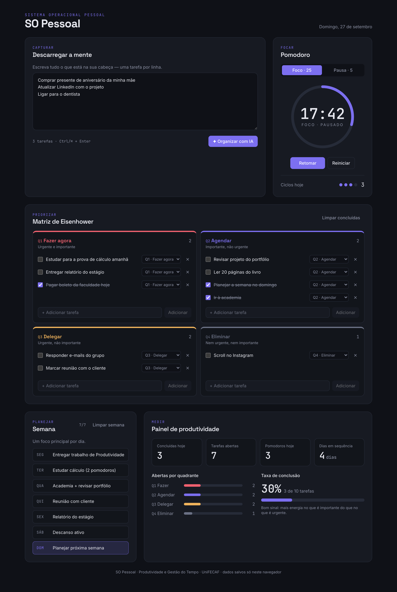
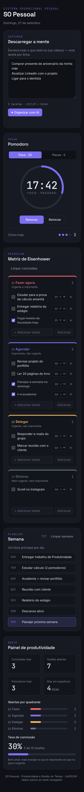

# SO Pessoal

> Um "sistema operacional pessoal" de produtividade: descarregue a mente, deixe a IA priorizar na Matriz de Eisenhower, foque com Pomodoro, planeje a semana e acompanhe seu progresso — tudo em uma única tela.

Projeto de portfólio da disciplina **Produtividade e Gestão do Tempo** — UniFECAF.



<details>
<summary>Versão mobile</summary>



</details>

---

## Funcionalidades

| Módulo | O que faz |
| --- | --- |
| **Descarregar a mente** | Textarea para despejar tarefas soltas (uma por linha). O botão **Organizar com IA** classifica cada uma na Matriz de Eisenhower. Atalho: `Ctrl/⌘ + Enter`. |
| **Matriz de Eisenhower** | 4 quadrantes — **Q1** fazer agora, **Q2** agendar, **Q3** delegar, **Q4** eliminar. Adicionar, concluir, mover entre quadrantes e excluir tarefas. |
| **Pomodoro** | Timer 25/5 com anel de progresso, contagem de ciclos do dia, aviso sonoro e tempo restante no título da aba. Continua de onde parou mesmo se a página for recarregada. |
| **Semana** | Planejamento Seg–Dom com **um foco principal por dia**; o dia atual fica destacado. |
| **Painel de produtividade** | Concluídas hoje, tarefas abertas, pomodoros do dia, dias em sequência, distribuição das abertas por quadrante e taxa de conclusão. |
| **Persistência** | Tudo salvo em `localStorage` — nada se perde ao recarregar. Sincroniza entre abas. |

## Ferramentas

- **[Next.js 16](https://nextjs.org/)** (App Router) + **TypeScript**
- **[Tailwind CSS 4](https://tailwindcss.com/)** com tokens de design próprios
- **[Groq API](https://console.groq.com/)** (compatível com OpenAI) — modelo `llama-3.3-70b-versatile`
- **localStorage** para persistência (via `useSyncExternalStore`, sem erros de hidratação)
- Fontes: **Space Grotesk** (títulos), **Inter** (texto), **JetBrains Mono** (números/timer) via `next/font`
- Deploy: **Vercel**

## Fluxo

```
┌───────────────────┐   POST /api/organizar   ┌──────────────────────────┐
│ Descarregar a     │ ──────────────────────▶ │ Route Handler (servidor) │
│ mente (navegador) │                         │  lê GROQ_API_KEY         │
└───────────────────┘                         └────────────┬─────────────┘
          ▲                                                │ JSON estrito
          │ { tasks:[{text,quadrant}],                     ▼
          │   source:"ia"|"heuristica" }      ┌──────────────────────────┐
          │                                   │ Groq · llama-3.3-70b     │
          │                                   └────────────┬─────────────┘
          │            falhou? (sem chave, timeout,        │
          │            HTTP≠200, JSON inválido)            │
          └──────── fallback heurístico por palavras-chave ◀┘
```

1. **Capturar** — escreva tudo em "Descarregar a mente".
2. **Priorizar** — "Organizar com IA" distribui as tarefas nos 4 quadrantes. Ajuste movendo entre quadrantes.
3. **Focar** — rode Pomodoros nas tarefas de Q1 e Q2.
4. **Planejar** — defina um foco por dia da semana (bom lugar para as tarefas de Q2).
5. **Medir** — acompanhe o painel e mantenha a sequência de dias ativos.

### Segurança da IA

- A chamada à Groq roda **somente no servidor**, em [`app/api/organizar/route.ts`](app/api/organizar/route.ts).
- A chave vem de `process.env.GROQ_API_KEY` — **sem** prefixo `NEXT_PUBLIC_`, portanto nunca vai para o bundle do navegador.
- `.env.local` está no `.gitignore`; só o modelo [`.env.example`](.env.example) é versionado.
- O prompt pede **JSON** explicitamente e descreve o formato (`response_format: json_object` exige isso). A resposta é validada item a item; o que vier inválido é reclassificado pela heurística.
- **O botão nunca quebra:** se a IA falhar, o servidor usa o classificador local ([`lib/classify.ts`](lib/classify.ts)); se o próprio servidor estiver fora do ar, o navegador roda a mesma heurística. A interface informa de onde veio a classificação.

### Acessibilidade

- Foco visível em todos os controles para navegação por teclado (`:focus-visible` com o violeta de destaque).
- Checkboxes, seletores e botões com `aria-label` descritivo (ex.: "Concluir tarefa: Pagar boleto").
- Timer com `role="timer"`, barras do painel com `role="meter"`/`progressbar` e status da IA anunciado via `aria-live`.
- Respeita `prefers-reduced-motion`: animações e transições são desligadas.

## Como usar

### Pré-requisitos

- Node.js 20+
- Uma chave gratuita da Groq em <https://console.groq.com/keys> (opcional — sem ela o app usa a classificação local)

### Rodando localmente

```bash
git clone <url-do-repositorio> so-pessoal
cd so-pessoal
npm install
cp .env.example .env.local   # e cole sua chave em GROQ_API_KEY
npm run dev
```

Abra <http://localhost:3000>.

### Scripts

| Comando | Descrição |
| --- | --- |
| `npm run dev` | Servidor de desenvolvimento |
| `npm run build` | Build de produção |
| `npm start` | Servir o build |
| `npm run lint` | ESLint |

### Deploy na Vercel

1. Importe o repositório em <https://vercel.com/new>.
2. Em **Settings → Environment Variables**, crie `GROQ_API_KEY` com sua chave (sem `NEXT_PUBLIC_`).
3. Deploy. 🚀

## Estrutura

```
app/
  api/organizar/route.ts   # IA no servidor + fallback
  layout.tsx               # fontes e metadados
  page.tsx                 # monta o dashboard
  globals.css              # tokens de cor, foco visível, reduced-motion
components/
  BrainDump.tsx            # Descarregar a mente
  matrix/                  # EisenhowerMatrix, Quadrant, TaskItem
  Pomodoro.tsx
  WeekPlanner.tsx
  Dashboard.tsx
  Header.tsx
  ui/                      # Card, Button
lib/
  useAppState.ts           # store + ações (persistência em localStorage)
  storage.ts               # carregar/salvar com versão
  classify.ts              # heurística por palavras-chave
  stats.ts                 # métricas do painel e streak
  types.ts, date.ts
```

## Identidade visual

| Token | Cor |
| --- | --- |
| Fundo | `#0F1117` |
| Superfície | `#171A22` |
| Acento | `#7C6FF0` |

---

Feito para a disciplina de Produtividade e Gestão do Tempo — UniFECAF.
